# The Bottleneck Isn't the Code
## Sitting in traffic…in a Ferrari

Generating code with artificial intelligence is driving a faster car into the same rush-hour commute and then being surprised you don't get to work any faster. A faster car doesn't mean a faster commute because the car's speed isn't the bottleneck—and neither is code generation. And while coding is important, software leaders should focus on how AI can shorten the whole commute: the product lifecycle from idea to user adoption.

Code generation is the current focus for two sensible reasons:

* **Current AI is good at code gen** — large language models (LLMs) train on enormous corpora (GitHub repositories, Stack Overflow answers, technical blog posts, and more), and code suits their sequential, "choose the next-most-likely-token" approach.
* **Code generation is easy to measure** — modern tooling tracks lines of code, code updates, merge and pull requests out of the box. While some would argue that this is simply the [streetlight effect](https://en.wikipedia.org/wiki/Streetlight_effect), there's a reason streetlights are where they are—that’s where the people are.

[DORA](https://getdx.com/blog/dora-metrics/), the dominant framework for measuring software delivery performance (codified in Forsgren, Humble, and Kim's *Accelerate*, 2018), shows where organizations point their instruments. *Lead Time for Changes*, one of the four original metrics (DORA has since added a fifth), is defined as *the time from first code commit to production* — the clock starts shortly after a developer begins coding. This isn't an accident. Teams measure from the first commit partly because it's easy to instrument, and partly because beginning further upstream in the process would expose how much time is lost before coding begins. Everything that happened before—the stakeholder interview, the requirements document, the three weeks the ticket sat in the backlog while product and engineering argued about scope—is invisible. We also miss the post-deployment time as users learn of a new feature and how to incorporate it into their workflows. So we measure what we can, optimize what we measure, and call it velocity.

To be fair, sometimes code generation *is* the bottleneck — when requirements are clearly understood, the impact is well-known, and there's little room to differentiate. A few examples:

* Upgrading an existing system to use a newer language version
* Porting an existing system to a new framework or language
* Building an automated test suite for a system that lacks adequate coverage

In such cases the problem is mostly toil: the goals are known, and the implementation simply needs updating. This is where AI code generation shines.

Code generation will always be needed, but to date, much of the AI investment has focused on just one step within the broader process, resulting in a lot of faster cars stuck in the same traffic jams. Newer frameworks, like SPACE, widen the aperture, but still keep the focus on *developer* productivity. If we’re going to make the commute faster, we must optimize *idea-to-adoption time*. To do that, we need a more granular breakdown of the steps from beginning to end.

---

## Where AI Actually Creates Leverage

Modern product thinking, as articulated by Marty Cagan and the Silicon Valley Product Group, divides feature development into two parallel tracks: continuous *discovery* — figuring out the right thing to build — and continuous *delivery* — building it well and getting it to users. Most engineering teams execute delivery well; many struggle with the prerequisite discovery, and almost none measure the impact of what they deliver. Considered this way, the overall product process breaks down across three phases:

*The full feature lifecycle — Code generation (the darker box within the Delivery phase) is the focus of much of today's AI effort.*

In more detail, the steps within the phases are:

**Discovery**
- Customer and market insight — which problems are worth solving? For whom? Or, more precisely, for which personas?
- Product strategy and prioritization — what bets should the organization make? Almost all features deliver *some* value, but which ones optimize customer impact based on the firm’s capabilities?
- Requirements and functional design — a description of what the feature should do and how, with enough precision to build it.
- Story decomposition — breaking design into implementable, estimable units of work.

**Delivery**
- Code generation — writing the software to implement the feature.
- Testing and quality assurance — verifying it does what was specified.
- Deployment — making the feature accessible to users.

**Impact** *(the track nobody talks about)*
- Adoption measurement — do users actually use the deployed feature?
- Impact measurement — how much better off are users with the deployed feature?

Today’s AI investment is concentrated almost entirely in the middle of the Delivery track, primarily in code generation and testing; the Discovery track is largely untouched. And the Impact track — the feedback loop that tells you whether any of this was worth doing — barely exists as a category of tooling at all.

---

## Shift Left: The Discovery Opportunity

Software engineering research has understood for decades that mistakes are born upstream and paid for downstream. Barry Boehm's foundational work in *Software Engineering Economics* (1981) is almost five decades old, but his "cost of late defects" curve still holds today: fixing a mistake during requirements gathering is virtually free, but after deployment it can be orders of magnitude more expensive to fix. Robert Glass reiterated this finding with another 30 years of data in *Facts and Fallacies of Software Engineering* (2002), showing that most IT system errors were due to wrong or missing requirements, not coding bugs. These findings predate LLMs by decades. They've been known, cited, and ignored in practice — because requirements work is hard to instrument and hard to hold people accountable for.

This is where the upstream AI opportunity is most clear. Better requirements don't just prevent rework downstream — they make code generation itself more effective. A coding agent working from a precise, unambiguous specification will produce better code than one working from a vague ticket. The gains compound: investment at the requirements layer pays off at the code layer too, in addition to all the rework it prevents. Shifting left with AI isn't a tradeoff against code generation productivity — it's a multiplier on it.

The applications are concrete:

* AI-assisted requirements gathering through structured stakeholder interviews
* Automated synthesis of customer feedback into product specifications
* Consistency checking of PRDs against existing system behavior
* Story decomposition that flags ambiguous or underspecified acceptance criteria before a developer ever picks up the ticket

These aren't science fiction — they're tractable applications of current LLM capabilities that are simply underinvested relative to their leverage.

---

## Shift Right: The Impact Opportunity

Most teams know when a feature shipped. Far fewer know whether it mattered. Once it's out the door, visibility gets hazy: did users adopt it? Did it solve the problem it was designed to solve? Did it introduce new issues?

The feedback loop from production back to requirements is where the real learning happens and for most organizations it's slow, noisy, and largely manual. Product managers might occasionally look at usage dashboards and the customer success team files tickets as users complain. But systematic measurement of feature-level adoption and outcome — and automated synthesis of that signal back into the requirements process for the next iteration — is rare.

AI has substantial untapped potential here: automated analysis of usage patterns, natural language synthesis of user feedback at scale, anomaly detection when adoption diverges from expectation, and closed-loop reporting that connects outcome measurement back to the original product hypothesis. Shifting right closes the loop that shifting left opens.

---

## What Current Work Exists Outside Code Generation

While opportunities abound, there’s little tooling and what exists is early. The most prominent example is [Superpowers](https://github.com/obra/superpowers), an open-source agentic framework that has gained significant traction in engineering communities. Rather than immediately generating code, Superpowers enforces a structured workflow: brainstorm first, extract a spec through dialogue, validate the design, then implement. This is meaningful progress — it ensures that coding agents work from clearer specifications than they would otherwise.

But Superpowers takes your requirements as a starting point and makes them crisper. It doesn't help you determine whether you're building the right thing in the first place. The product decision — what to build, for whom, and why — remains entirely human. The tool improves the quality of execution given a direction; it doesn't help you find the right direction.

On the research side, the academic community has only recently started asking these questions. A 2025 academic review ([Large Language Models (LLMs) for Requirements Engineering (RE): A Systematic Literature Review](https://arxiv.org/abs/2509.11446)) found 74 primary studies on LLMs applied to requirements engineering — all published between 2023 and 2024, with no prior work before 2023 despite the existence of capable language models since 2018. The authors suggest that “the RE community, much like the general public, became enthusiastic about LLMs primarily when ChatGPT drew widespread attention to the technology” and while rapidly growing, the field remains exploratory, mostly studied in controlled environments, and far from industrial adoption.

The gap between where AI investment goes and where the research says the leverage lies couldn't be wider.

---

## What's Missing

Two areas stand out as underserved relative to their potential impact:

* **Competitive analysis and product strategy.** The decision of what to build is the highest-leverage decision in the feature delivery lifecycle. A well-reasoned product bet that turns out to be wrong costs more than any implementation bug. AI tools that help product and engineering leaders reason about competitive positioning, synthesize market signals, and stress-test product hypotheses before committing engineering resources don't really exist yet in any systematic form.

* **Driving and measuring adoption.** Shipping a feature that nobody uses is waste in the lean sense — it consumed resources and created no value. Yet most organizations treat adoption as a lagging indicator rather than an active target. AI-assisted adoption strategies — personalized onboarding, proactive surfacing of underused features, automated identification of users who would benefit from a feature they haven't discovered — are largely absent from the current tooling landscape.

---

## What’s Next

The opportunity in front of engineering leaders isn't to ignore code generation — it's to resist the assumption that code generation is the primary lever. It isn't. It never was.

The real opportunity is to bring the same focused intensity to the parts of the feature delivery lifecycle that have received little AI attention to date:
* Measure idea-to-adoption time to find the areas most in need of improvement
* Ship a hypothesis (and an instrumentation plan to falsify that hypothesis) alongside every feature
* Put AI to work before the ticket ever reaches the developer

Code generation is not the bottleneck. The bottleneck is everywhere else.

---

*This is the first in a series on AI throughout the feature development lifecycle. Subsequent essays will examine specific techniques for applying AI at each stage, how to rethink engineering metrics to make the upstream work visible, and the emerging role of forward-deployed engineering as a structural response to the requirements problem.*